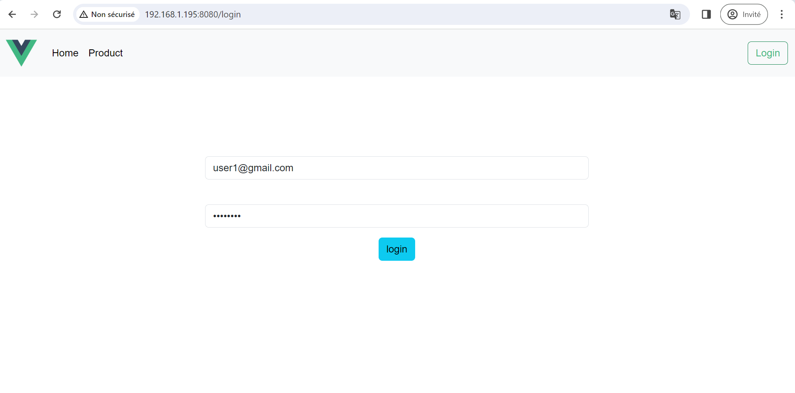
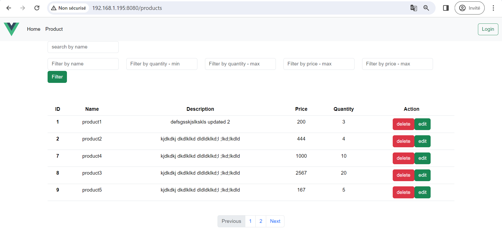
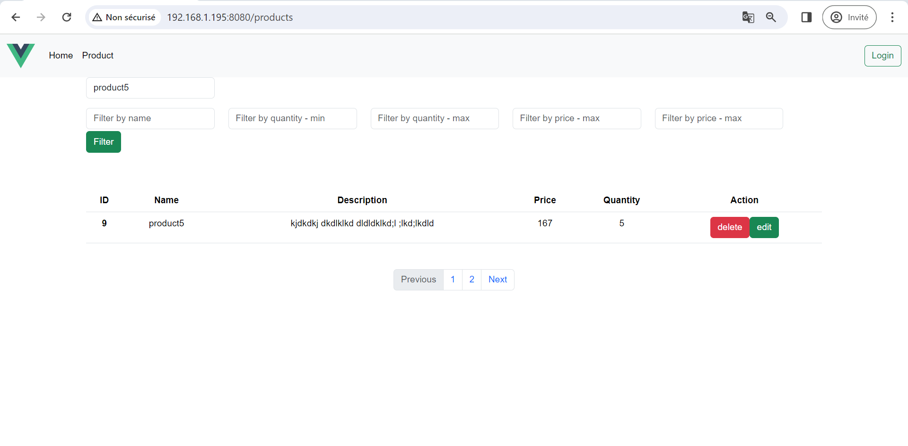
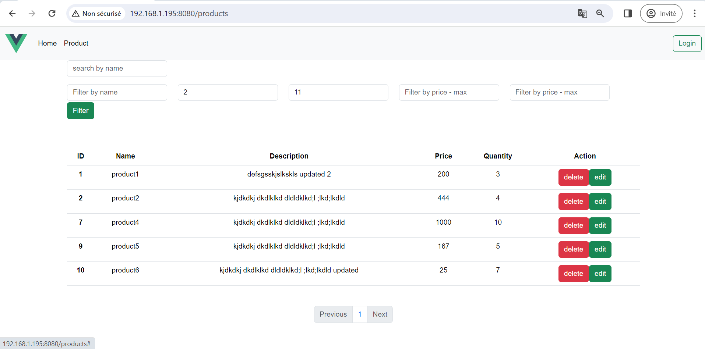
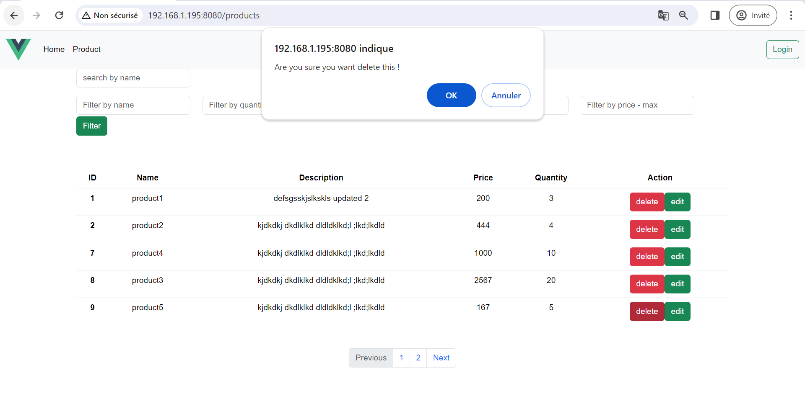
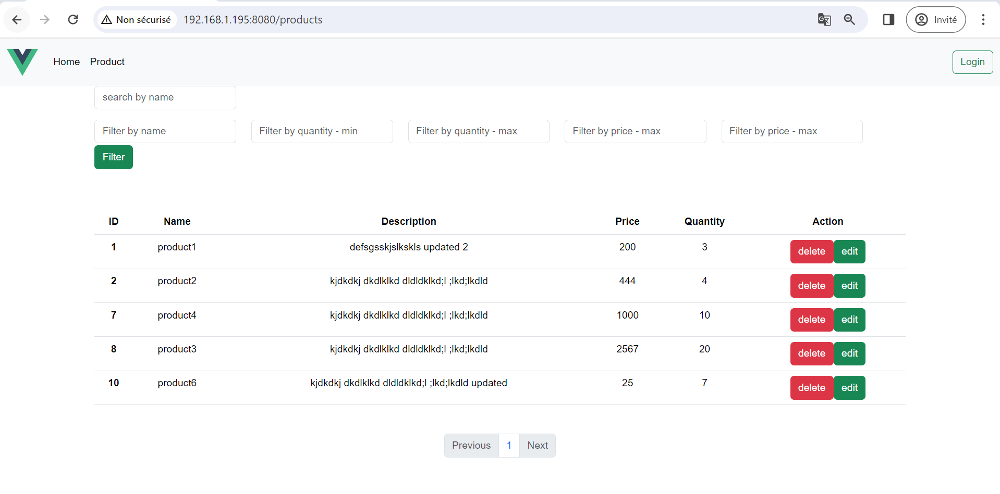
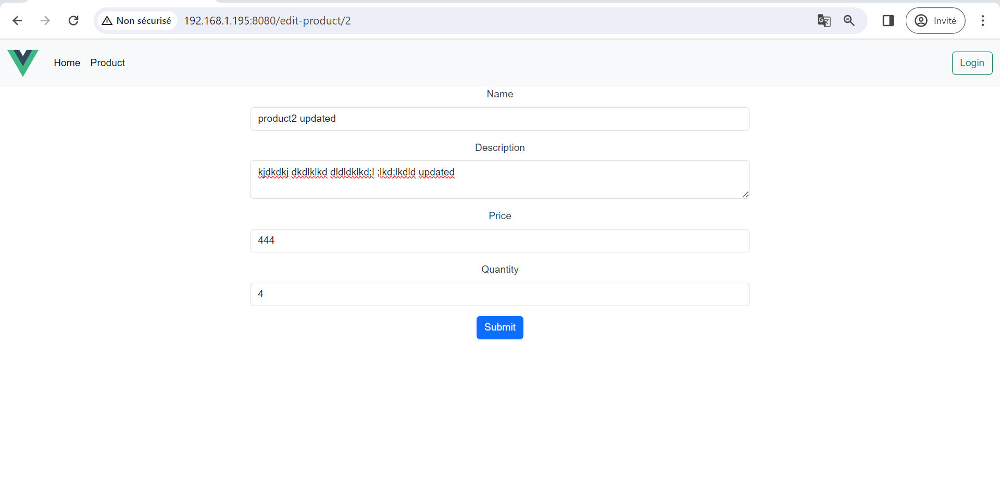
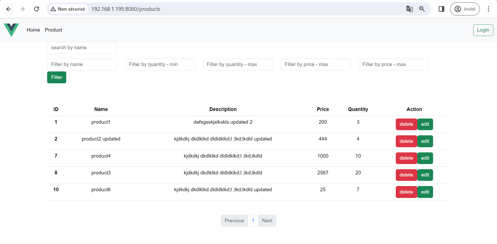
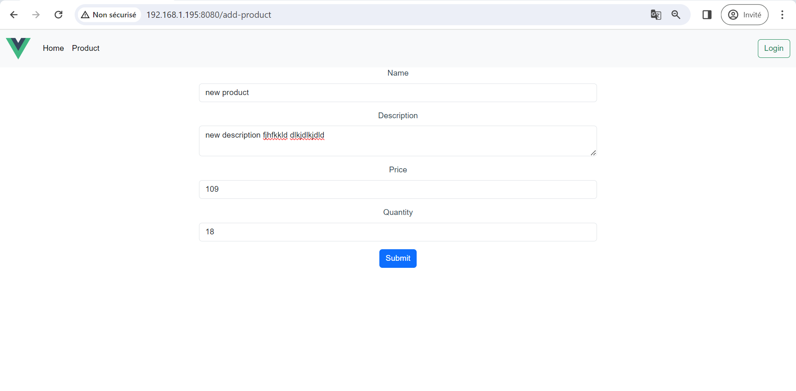
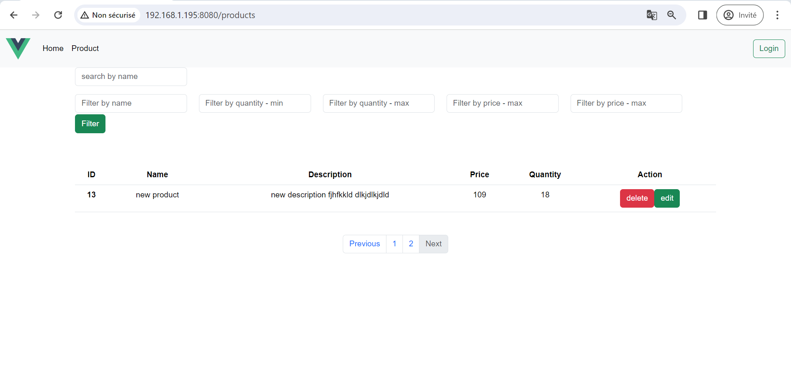

<h1>All Interfaces</h1>

<h4>Login page - url : /login</h4>

 
<h4>Display products - url : /products</h4>

 
<h4>Display products with search</h4>

 
<h4>Display products with filters</h4>

 
<h4>Display products with paginate</h4>

 
<h4>Delete product</h4>

 
<h4>After delete product</h4>

 
<h4>Update product</h4>

 
<h4>After updated product</h4>

 
<h4>Add product</h4>

 
<h4>After add product</h4>

 
